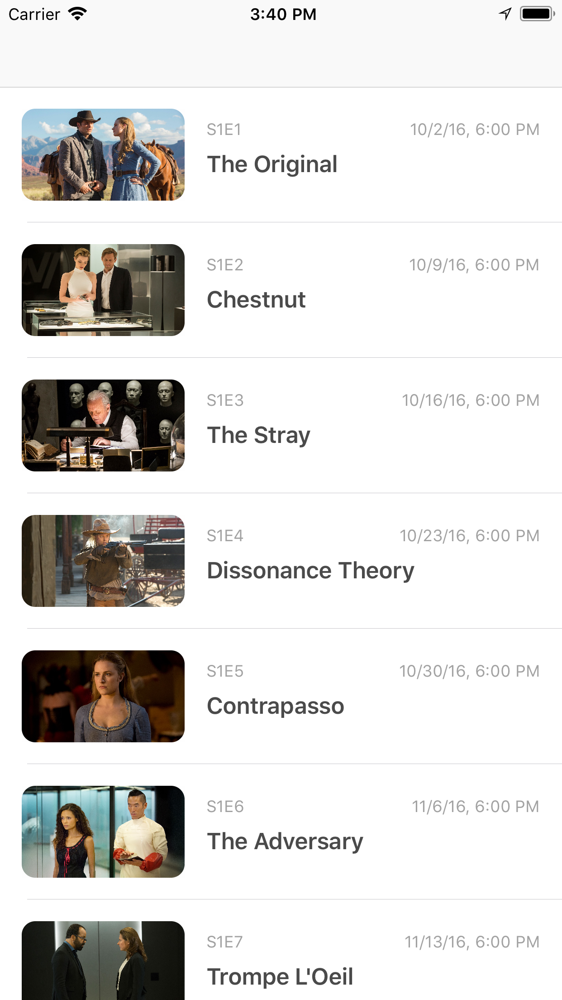

## Objectives

We don't expect you to finish all the tasks, but they should be done in the order presented here. Feel free to ask any questions!

## Listing episodes

Listing Westworld's episode list, using TVmaze's [APIs](https://www.tvmaze.com/api).

In particular, you should use `https://api.tvmaze.com/shows/{show_id}?embed=seasons` to fetch basic info about the show and a list of seasons.

Westworld's ID is 1371.

Then, you should call `https://api.tvmaze.com/seasons/{season_id}/episodes` for each season fetched with the other API and show all episodes, in order,
in a table view.

## Add when the episode aired

This information is available on the API, but we're not consuming it.

## Add unit tests

We don't have any unit tests at all in this project.

## Group tableview by season

Westworld only has 2 seasons so far, but grouping the tableview by season would be a great addition. 

You should use the season number and name as a header.

## What you already have

- Models for those API calls (`Show.swift` and `Episode.swift`)
- `API.swift` to make generic API calls
- `API+Rx.swift` if you want to use [RxSwift](https://github.com/ReactiveX/RxSwift)
- `UIImageView+RemoteImage.swift` to load an image from an URL
- `EpisodeCell.swift` which is the cell

## Notes

Feel free to use any libraries you want (CocoaPods is already setup on the project).

It's OK to use Google, StackOverflow or any other resource you'd normally use.

* API reference: https://www.tvmaze.com/api
